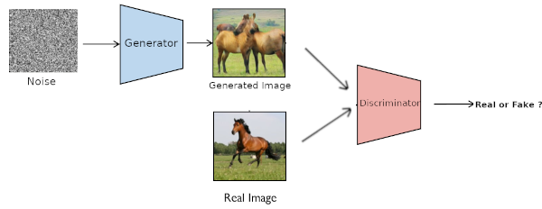
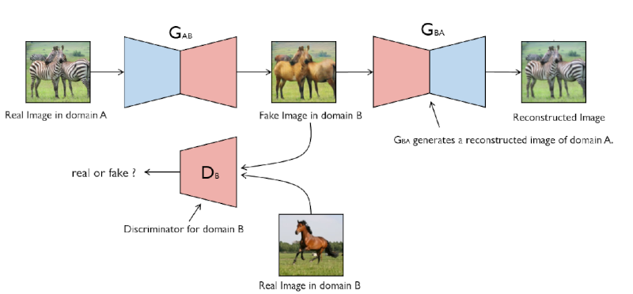

# Signature Cleaning using CycleGAN
## Cycle GAN
  
[Cycle GAN](https://arxiv.org/abs/1703.10593) is a generative model that can perform image to image translation with unpaired images. That means we can translate between an image in domain A (horse) to an image in domain B (zebra) without having to train the model with matching pair of images. Training a model for image-to-image translation typically requires a large dataset of paired examples. These datasets can be difficult and expensive to prepare, and in some cases impossible. I have used CycleGAN to translate between a noisy signature and a clean signature.  
  

  
*CycleGANS* are part of a generator architectures called as [GAN(Generative Adversarial Networks).](https://machinelearningmastery.com/what-are-generative-adversarial-networks-gans/) GANS are known as the Picasso's of the machine learning world. They can essentially *draw or create* by their own. GANs works by defining two networks that are pitted against each other. A generator network will tries to learn how to recreate an image while the discriminator tries to identify whether that image is an actual image or an image generated by the generator. At the end of the training process, the generator learns to create images that are similar to the actual images, and the discriminator ends up thinking they are real.  
  
**CycleGANS** works on a similar principle, except it has two generators and discriminators. The CycleGAN model tries translate images from domainA (horse) to domainB (zebra). The generatorA (horse) will try to translate the image into domainB (zebra). The discriminatorB predicts whether the image is real or fake. From the generated image in domainB (zebra), the generatorB has to reconstruct the original image (horse).This cycle-consistency behavior allows the model to translate an image in both directions, ie from horse to zebra and from zebra to horse without matching data pairs.  
  

## Signature Cleaning with CycleGAN
The official repo of **CycleGAN** can be found [here](https://github.com/junyanz/pytorch-CycleGAN-and-pix2pix). We use it to train the model to work with our Signature detection use case.  
Since CycleGANs are able to learn the underlying mapping between two domains A and B, it could be extended to our use case for signature cleaning. This technique is defined in [this paper](https://arxiv.org/abs/2004.12104). For training I used the [Kaggle Signature Dataset](https://www.kaggle.com/robinreni/signature-verification-dataset) for the domain A (clean signatures.) I generated the noisy signatures by adding random lines and texts at random positions in the clean images using [this notebook](CycleGAN-Data_Preperation_Adding_Noise.ipynb).  
  
CycleGANs requires square images for training, so to standardize the images, I wrote code for resizing the images to a 512x512 square with the signature at the center and two black (transparent) strips at the top and bottom of the image.  
  
We also have to store the data folders in a particular structure. There should be sub-folders testA, testB, trainA, and trainB inside `datasets\dataset_name`. In trainA/testA, place the clean images (domainA) and in trainB/testB, place the noisy images.  
`datasets`  
&nbsp;&nbsp;&nbsp;&nbsp; |-> `dataset_name`  
&nbsp;&nbsp;&nbsp;&nbsp;&nbsp;&nbsp;&nbsp;&nbsp; |-> `trainA`   
&nbsp;&nbsp;&nbsp;&nbsp;&nbsp;&nbsp;&nbsp;&nbsp; |-> `trainB`   
&nbsp;&nbsp;&nbsp;&nbsp;&nbsp;&nbsp;&nbsp;&nbsp; |-> `testA`   
&nbsp;&nbsp;&nbsp;&nbsp;&nbsp;&nbsp;&nbsp;&nbsp; |-> `testB`   
  
The code required to do *to generate noisy images*, *to structure the dataset into CycleGAN folder structure* and *to convert the images into a standardized form* could be found in [this notebook.](CycleGAN-Data_Preperation_Adding_Noise.ipynb)  
  
## Training the model.
**Use [this notebook](SignatureCleaningCycleGAN.ipynb) to train and test the CycleGAN model.**  
The data in CycleGAN format is available [here](https://drive.google.com/drive/u/0/folders/1397Q9nqMqEsSesB9UvlIL1u1IGzrUOIK) as a zip file.  

Clone the official [CycleGAN repo] and install the requirements using the `requirements.txt` file.  
Our signature dataset must to be added to the `datasets` folder of the cloned repository.  
  
  
The following line could be used to train the model.  
`python train.py --dataroot ./datasets/dataset_name --name model_name --model cycle_gan`  
  
Change the `--dataroot` and `--name` to the custom dataset path and model name.  
Use `--gpu_ids` 0,1,.. to train on multiple GPUs.  
The model_name we use for testing should be consistent with the model_name we used for training as well.  
> `!python train.py --dataroot ./datasets/gan_signdata_kaggle --name gan_signdata_kaggle --model cycle_gan`  
  
**Training arguments**
By default, the model trains for 100 epochs, to train for more epochs, use `--n_epochs #epoch_count`. The model will be trained for (100 + epoch_count) epochs.  
To continue training after you stop the training, use `--continue_train` and set `--epoch_count #epoch_number`. This will resume the training from *epoch_number* epoch.
eg: `--continue_train --epoch_count 110` will resume the training from epoch 110.
  
  
The model can translate the image in both directions (noisy to clean and clean to noisy). For our use case, we have to translate from noisy to clean. So after training, copy the latest Generator(B) `/checkpoints/model_name/latest_net_G_B.pth` as `latest_net_G.pth` under `/checkpoints/model_name/latest_net_G.pth`.
Use `cp ./checkpoints/horse2zebra/latest_net_G_B.pth ./checkpoints/horse2zebra/latest_net_G.pth` (see under testing section)
  
  
**I recommend you to refer [here](https://github.com/junyanz/pytorch-CycleGAN-and-pix2pix/blob/master/docs/tips.md) and [here](https://github.com/junyanz/pytorch-CycleGAN-and-pix2pix/blob/master/docs/qa.md). These will helps to clear a good amount of doubts and errors. Also I recommend you to go through the issues section of the repo if you faces any errors or doubts. Legend has it that you will find the solution for your miseries there.**  
  
  
## Testing the model

-   `python test.py --dataroot datasets/dataset_name/testA --name model_name --model test --no_dropout`

Change the `--dataroot` and `--name` to be consistent with your trained model's configuration.

> from https://github.com/junyanz/pytorch-CycleGAN-and-pix2pix:
> The option --model test is used for generating results of CycleGAN only for one side. This option will automatically set --dataset_mode single, which only loads the images from one set. On the contrary, using --model cycle_gan requires loading and generating results in both directions, which is sometimes unnecessary. The results will be saved at ./results/. Use --results_dir {directory_path_to_save_result} to specify the results directory.

> For your own experiments, you might want to specify --netG, --norm, --no_dropout to match the generator architecture of the trained model.  
  

**To copy the latest generator model, use the follwing code.**  
`cp ./checkpoints/gan_signdata_kaggle/latest_net_G_B.pth ./checkpoints/gan_signdata_kaggle/latest_net_G.pth`  
  
Clean images could be generated using `test.py`.  
> `!python test.py --dataroot datasets/gan_signdata_kaggle/testB --name gan_signdata_kaggle --model test --no_dropout`  
  

